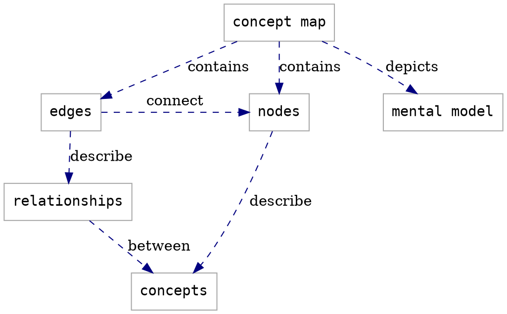

# Lesson Design Notes
_Fan Du_  

:::info
Users are expected to follow **[The Carpentries Code of Conduct](https://docs.carpentries.org/topic_folders/policies/code-of-conduct.html)**.

All content is publicly available under the [Creative Commons Attribution License](https://creativecommons.org/licenses/by/4.0/).
:::

_Status of the document: under development (as of February 19, 2021)_  

**Tentative Lesson Title: Make Software Citable**   

<!-- inserts a Table fo Contents: don't change the line below -->
[TOC]

## Target Audience

### Learner Profile 1

_Tori is a PhD student in public policy. She is proficient in Python and uses it a lot when analyzing data for her research. She is currently occupied by a project for which she collects data online mainly via APIs of social media platforms or open data portals. She thinks that her workflow could help researchers working on the similar topic/same data sources; so it would be useful to share her data collection and analysis code with the her research community. She hopes that code sharing could ease the replication of her study, and also attract more researchers to get their hands on looking into her research cases.
Tori is familiar with data analysis using Python, but not necessarily with how to publish her own software as she never did it before. Though, by taking an introductory computational social science methods course in her department, she has learned how to effectively manage her code and data. Currently, she put some of her analysis notebook files in a GitHub repository. But it is mainly for her own convenience because she is quite comfortable with the collaborative Git workflow when working with some of her close colleagues. It is not a widely visible and engaged community project. Tori also does not have the intention to make it a community project at the moment._  

Tori's background knowledge and skills include:
* Data analysis in Python and share code with colleagues in legible notebooks
* Collaboration with other researchers with Git

Tori's learning goals include:
* Publish her code along with her research results
* Make sure her code is citable and discoverable via academic databases
* Share her code in a way that is compatible to her current workflow, but also accessible to other researchers

Thus, the knowledge and skills that can be acquired to achieve her goals include:
* Linking her code to her research publication when releasing it
* Publish her code in a way that is also convenient for potential future updates
* Understand how her published code could be found and accessed by others 

### Learner Profile 2

_Tom is currently a postdoc at a university-affiliated research center focused on ecological and environmental science. He has been proficient in R and using it for data analysis in his research projects for a long time. One of his ongoing projects focuses on the population trends of specific fish species in the long term. His data sources include observation data collected on site and shared via online data portals. He also do mathematical and statistical modeling, trying to estimate the future trends of specific fish popolation size and viualize the prediction results.
Tom wants to release his modeling and visualization code for inferring the fish population trends in the long term. He thinks it could help other researchers doing similar things such as tracking other animal specie population trends. He hopes to make some software contribution to the larger research community, with the willingness to maintain the software release for the long term. He would like to package his code and put it on a R package server. It is the first time he decides to do so._

Tom's background knowledge and skills include:
* Familiar with R and is able to structure and package his code well

Tom's learning goals include:
* Understand how to make his upcoming R package citable during release
* Let his future users understand how to cite his package

The knowledge and skills can be acquired to achieve his goals include:
* Make his package citabe in both language-specific and language-agnostic ways
* Educate his users how to cite his package
* Release his package in a way that he can provide regular updates and support, including the citation information

### Learner Profile 3

_Katy recently just got hired in a chemistry lab group as a postdoc. She now is taking care of the simulation codes created in the lab years ago. The lab group has been working on the code in a GitHub repository. They also have maintained a website where they host the documentation and provide some visibility for research publications using the code. The lab has been releasing their code written mostly in C++ via the website for some time. It was until very recently they rewrote the simulation method in Python for convience use and better uptake. The Pythonification work was done on GitHub, and Katy is continuously improving it now. Naturally they started to release the code via GitHub.
Katy needs to manage the release of two parallel versions of the code in different languages via both GitHub & the lab website. Of course the whole lab wants to make their code release citable and it becomes the responsibility of Katy now. Katy works on code almost in a daily basis but it is also her first time to handle software releases and make sure things are citable._

Katy's background knowledge and skills include:
* Familiar with the structure, development, and the use of the code
* Familiar with GitHub features, and how to update the lab website

Katy's learning goals include:
* Understand how to make the code citable via GitHub and her lab website, including other possibilities
* Understand how to keep the code citable through every upcoming release

### Notes
:::info 
**Prompt**: Add any relevant information about how and why you chose this target audience here. Information like this can be helpful for future collaborators/contributors/users to understand the scope of your lesson.
:::

**Thoughts on creating learner profiles**:
This is really about thinking about the use cases of the skills to be taught. For me, this lesson is not supposed to be domain-specifc. The need to make software citable arises when researchers intend to share their code with their research community. It should be the endpoint of their data analysis workflow; and the workflow is expected to be reproducible and useful for other researchers as well. Thus it is part of the task of code sharing and distribution. This is the universal use scenario.   
However, researchers write code to analyze data in various disciplines, using different methods. In other words, the task types for which they write code are different: Some may be handling empirical data, or digital trace data; while others may be doing computational modelling and simulating data. They may be writing code in different programming languages, thus the way the code is organized, packaged, and distributed is different.   
Researchers' computing skill levels are varied, too. Some may just adopted computating skills for doing science; while the others may be seasoned software developers, however, not necessarily being familiar with how to make software citable.   
What could be their pain points? At this point, presumably (i.e., without surveying the target audience), once having the intention to publish their software, they are willing to make their software citable but do not know the best choice for their specific scenario. They might not know how the system of software citation works, so that hinders their vision to make a better decision to make their code citable, identifiable, and discoverable online.  
Would the software to be published a group project, or an individual project matter?  

The first case is to publish research compendium along with publications.
The second case is a deliberate package release in a language ecosystem.
The third case is self-managed software release, but also on a platform.

In order to work for different learner profiles, things can be taught:
* How to make software citable via different release/publicizing channels
* How to keep software citable during regular updates/releases, as part of the maintenance work
* How to increase the visibility, discoverability, and accessibility of the software, to users and systems of online information retrieval
* Ideally, how to make "maintaining software citable" part of the software creators' and maintainers' workflow
* "Making software citable" as part of the user outreach 

## Learning Objectives

FIXME fill in the block below with learning objectives for your whole lesson, then move the whole block to `index.md`

> ## Learning Objectives
> After following this lesson, learners will be able to:
>  
> - **Understand** what blocks the visibility, discoverability, and accessibility of their software online
> - **Identify** their options to make software citable and discoverable
> - **Implement** their software discoverability and citability choice
> - **Maintain** the discoverability and citability of their software
> - **Integrate** the creation and maintenance of their software citability into their workflow
> - **Inform** their users when and how to cite their software
> - **Evaluate** their choice and practice of maintaining software citability
{: .objectives }

### Notes

FIXME add any relevant information about how and why you defined these objectives here. Information like this can be helpful for future collaborators/contributors/users to understand the scope of your lesson.

## Concept Maps

FIXME Add concept map(s) for your lesson here. You can  embed a photo or other image file, or use the [GraphViz](https://graphviz.org/) syntax demonstrated below.

### Lesson Concept Map

You can put concepts maps for the whole lesson here...

### Episode Concept Maps

...and concept maps for individual episodes here.

## Data Set

FIXME add notes here about any criteria you used when choosing a data set for your lesson.  
What are the advantages of this data set?  
Do you anticipate any challenges associated with using this data in the lesson?  
Did you identify any other data sets and/or example tasks that could also be used to teach this lesson?

## Additional Design Notes

FIXME add notes to this section that do not fit elsewhere
in the page. Topics for this section might include

- what has been tried that did not work
- 

:::info
General questions or feedback? Contact [team@carpentries.org](mailto:team@carpentries.org).
:::
